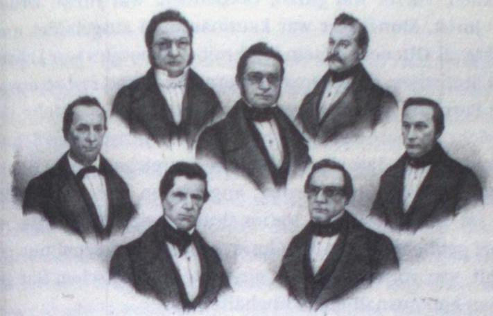

# Switzerland and Beyond

\[5 novembre 2025, FB]

This project is the follow up of the Geovistory Switzerland and Beyond project in WissKI.

We habe two main aims:
* publishing the information formerly available in the Geovistory project
* identifying open data portraits of persons and annotating the images in WissKi with the identifirs in order to connect the spot on the picture and the information about the person in the graph.

 

See this example of the Federal Council 1848:

 

Source: [Wikimedia Commons, public domain](https://commons.wikimedia.org/wiki/Conseil_f%C3%A9d%C3%A9ral_1848.jpg)

 

Rang supérieur, de g. à d.: Henri Druey, Jonas Furrer, Ulrich Ochsenbein.

Rang inférieur, de g. à d.:
Josef Munzinger, Stefano Franscini, Matthias Näff, Friedrich Frey-Herosé.

Source 	*Bildersammlung der Universitätsbibliothek Basel*